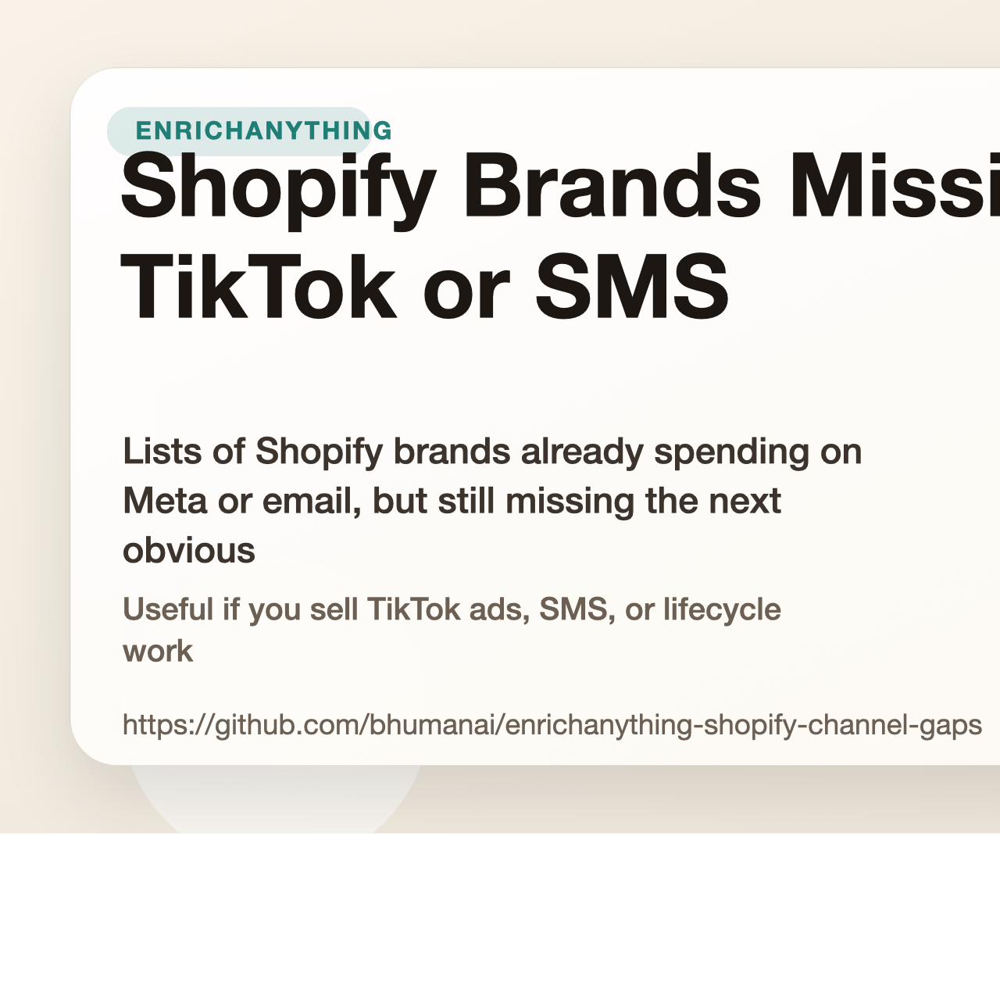

# Shopify Brands Missing TikTok or SMS

Lists of Shopify brands already spending on Meta or email, but still missing the next obvious channel.

Useful if you sell TikTok ads, SMS, or lifecycle work to ecommerce brands.

## Start here

- Fastest first click: [Shopify brands in the UK running Meta ads but not TikTok](https://www.enrichanything.com/markets/shopify-uk-meta-no-tiktok?utm_source=github&utm_medium=public_repo&utm_campaign=enrichanything-shopify-channel-gaps&utm_content=market-shopify-uk-meta-no-tiktok) (live)
- Cleaner web version: [https://bhumanai.github.io/enrichanything-shopify-channel-gaps/](https://bhumanai.github.io/enrichanything-shopify-channel-gaps/)
- Full product: [EnrichAnything](https://www.enrichanything.com/?utm_source=github&utm_medium=public_repo&utm_campaign=enrichanything-shopify-channel-gaps&utm_content=repo-home)

- Source product: https://www.enrichanything.com
- GitHub repo: https://github.com/bhumanai/enrichanything-shopify-channel-gaps
- Public API docs: https://www.enrichanything.com/api/
- OpenAPI spec: https://www.enrichanything.com/openapi.json
- Last refresh: March 30, 2026
- Refresh command: `npm run refresh`

## Developer links

- Public API docs: [EnrichAnything API](https://www.enrichanything.com/api/)
- Node SDK repo: [enrichanything-public-api-node](https://github.com/bhumanai/enrichanything-public-api-node)
- Python SDK repo: [enrichanything-public-api-python](https://github.com/bhumanai/enrichanything-public-api-python)

## Use this repo if...

- TikTok agencies: Start with brands already spending on Meta. The pitch is not 'you should try paid social.' It is 'you already buy traffic, so TikTok is the next obvious test.' Start with [Shopify brands in the UK running Meta ads but not TikTok](https://www.enrichanything.com/markets/shopify-uk-meta-no-tiktok?utm_source=github&utm_medium=public_repo&utm_campaign=enrichanything-shopify-channel-gaps&utm_content=market-shopify-uk-meta-no-tiktok) (live).
- SMS and lifecycle teams: Use the Klaviyo-without-SMS lists. You are not selling retention from scratch. You are finishing a stack the brand already started. Start with [Shopify brands in France using Klaviyo but not SMS tooling](https://www.enrichanything.com/markets/shopify-france-klaviyo-no-sms?utm_source=github&utm_medium=public_repo&utm_campaign=enrichanything-shopify-channel-gaps&utm_content=market-shopify-france-klaviyo-no-sms) (live).
- Freelance growth operators: Use the repo as a narrowed prospect pool, then manually validate the top twenty stores before sending anything. Start with [Shopify brands in Germany using Klaviyo but not SMS tooling](https://www.enrichanything.com/markets/shopify-germany-klaviyo-no-sms?utm_source=github&utm_medium=public_repo&utm_campaign=enrichanything-shopify-channel-gaps&utm_content=market-shopify-germany-klaviyo-no-sms) (live).

## Lists you can use now

| List | Status | Rows | Open |
| --- | --- | ---: | --- |
| [Shopify brands in France using Klaviyo but not SMS tooling](markets/shopify-france-klaviyo-no-sms/README.md) | live | 20 | [Open in EnrichAnything](https://www.enrichanything.com/markets/shopify-france-klaviyo-no-sms?utm_source=github&utm_medium=public_repo&utm_campaign=enrichanything-shopify-channel-gaps&utm_content=market-shopify-france-klaviyo-no-sms) |
| [Shopify brands in Germany running Meta ads but not TikTok](markets/shopify-germany-meta-no-tiktok/README.md) | collecting sample | 12 | [Open in EnrichAnything](https://www.enrichanything.com/markets/shopify-germany-meta-no-tiktok?utm_source=github&utm_medium=public_repo&utm_campaign=enrichanything-shopify-channel-gaps&utm_content=market-shopify-germany-meta-no-tiktok) |
| [Shopify brands in Germany using Klaviyo but not SMS tooling](markets/shopify-germany-klaviyo-no-sms/README.md) | live | 20 | [Open in EnrichAnything](https://www.enrichanything.com/markets/shopify-germany-klaviyo-no-sms?utm_source=github&utm_medium=public_repo&utm_campaign=enrichanything-shopify-channel-gaps&utm_content=market-shopify-germany-klaviyo-no-sms) |
| [Shopify brands in the UK running Meta ads but not TikTok](markets/shopify-uk-meta-no-tiktok/README.md) | live | 22 | [Open in EnrichAnything](https://www.enrichanything.com/markets/shopify-uk-meta-no-tiktok?utm_source=github&utm_medium=public_repo&utm_campaign=enrichanything-shopify-channel-gaps&utm_content=market-shopify-uk-meta-no-tiktok) |

## Notes that explain the market

| Note | Status | Rows | Open |
| --- | --- | ---: | --- |
| [French Shopify brands still leave SMS out of an otherwise mature Klaviyo stack](reports/france-klaviyo-sms-gap/README.md) | live | 20 | [Open in EnrichAnything](https://www.enrichanything.com/reports/france-klaviyo-sms-gap?utm_source=github&utm_medium=public_repo&utm_campaign=enrichanything-shopify-channel-gaps&utm_content=report-france-klaviyo-sms-gap) |
| [German Shopify brands still leave SMS out of an otherwise mature Klaviyo stack](reports/germany-klaviyo-sms-gap/README.md) | live | 20 | [Open in EnrichAnything](https://www.enrichanything.com/reports/germany-klaviyo-sms-gap?utm_source=github&utm_medium=public_repo&utm_campaign=enrichanything-shopify-channel-gaps&utm_content=report-germany-klaviyo-sms-gap) |
| [German Shopify brands still underuse TikTok after proving Meta demand](reports/germany-meta-tiktok-gap/README.md) | collecting sample | 12 | [Open in EnrichAnything](https://www.enrichanything.com/reports/germany-meta-tiktok-gap?utm_source=github&utm_medium=public_repo&utm_campaign=enrichanything-shopify-channel-gaps&utm_content=report-germany-meta-tiktok-gap) |
| [UK Shopify brands still underuse TikTok after proving Meta demand](reports/uk-meta-tiktok-gap/README.md) | live | 22 | [Open in EnrichAnything](https://www.enrichanything.com/reports/uk-meta-tiktok-gap?utm_source=github&utm_medium=public_repo&utm_campaign=enrichanything-shopify-channel-gaps&utm_content=report-uk-meta-tiktok-gap) |

## Still queued up

These list ideas exist already, but the public sample is not ready yet.

| List | Status |
| --- | --- |
| [Shopify brands in France running Meta ads but not TikTok](markets/shopify-france-meta-no-tiktok/README.md) | template only |
| [Shopify brands in Spain running Meta ads but not TikTok](markets/shopify-spain-meta-no-tiktok/README.md) | template only |
| [Shopify brands in Sweden running Meta ads but not TikTok](markets/shopify-sweden-meta-no-tiktok/README.md) | template only |
| [Shopify brands in the Netherlands running Meta ads but not TikTok](markets/shopify-netherlands-meta-no-tiktok/README.md) | template only |

## Notes still queued up

| Note | Status |
| --- | --- |
| [Dutch Shopify brands still underuse TikTok after proving Meta demand](reports/netherlands-meta-tiktok-gap/README.md) | template only |
| [French Shopify brands still underuse TikTok after proving Meta demand](reports/france-meta-tiktok-gap/README.md) | template only |
| [Spanish Shopify brands still underuse TikTok after proving Meta demand](reports/spain-meta-tiktok-gap/README.md) | template only |
| [Swedish Shopify brands still underuse TikTok after proving Meta demand](reports/sweden-meta-tiktok-gap/README.md) | template only |

## Need a custom cut?

Open [EnrichAnything](https://www.enrichanything.com/?utm_source=github&utm_medium=public_repo&utm_campaign=enrichanything-shopify-channel-gaps&utm_content=repo-home) if you want more columns, a fresh export, or the same pattern for a different niche.
